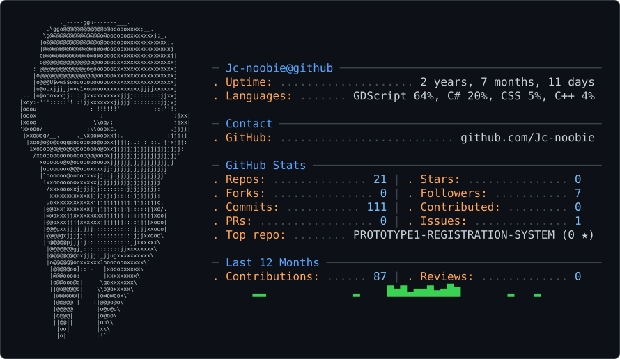

# Joed Donaire
4th Year CS Student · Team Lead · Web Developer (Learning)
 <source media="(prefers-color-scheme: dark)" srcset="dark_mode.svg" />
 <source media="(prefers-color-scheme: light)" srcset="light_mode.svg" />
 

<!--
# Joed Donaire

4th Year CS Student · Team Lead · Web Developer (Learning)

---

### 🛠 Currently learning
Web Development — building apps, sharpening system design & programming fundamentals.

### 📌 Pinned Projects
_(pin your repos on your GitHub profile page — they'll show up below this automatically)_

---
-->

<!-- <h2>Why I build in public</h2>

<table width="100%">
<tr>
<td width="33%" valign="top"><h3>Focus</h3>
<code>GDScript</code> · <code>C#</code> · <code>CSS</code>
</td>
<td width="33%" valign="top"><h3>Proof</h3>
21 public repositories · 0 stars
</td>
<td width="33%" valign="top"><h3>Contribution</h3>
87 contributions · 44 active days
</td>
</tr>
</table> -->

<!-- <h2>Open-source toolbox</h2>

<code>jc-noobie@github ~ $ toolbox --list</code>

<picture>
  <source media="(prefers-color-scheme: light)" srcset="https://www.gitskins.com/api/section/stack?username=jc-noobie&theme=neon&avatar=https%3A%2F%2Favatars.githubusercontent.com%2Fu%2F158983119%3Fu%3Df79f3a96d742116505e2ba98d2cefb186d2b9d25%26v%3D4&style=terminal&v=oss-stack-1&mode=light" />
  
</picture>

 -->

<!-- <table width="100%">
<tr>
<td width="17%" align="center"><strong>GDScript</strong> 64%</td>
<td width="17%" align="center"><strong>C#</strong> 20%</td>
<td width="17%" align="center"><strong>CSS</strong> 5%</td>
<td width="17%" align="center"><strong>C++</strong> 4%</td>
<td width="17%" align="center"><strong>JavaScript</strong> 3%</td>
<td width="17%" align="center"><strong>HTML</strong> 2%</td>
</tr>
</table>

<h2>Repositories worth exploring</h2>

<picture>
  
</picture>

<table width="100%">
<tr>
<td width="25%" valign="top"><h3><a href="https://github.com/Jc-noobie/SOLVING-PROBLEMS-WITH-JAVASCRIPT">SOLVING-PROBLEMS-WITH-JAVASCRIPT</a></h3>
this is a subrepo (if you will) of my &quot;learning javascript till I became good at it&quot; , I will try to solve problem using javascript, programming probl

JavaScript · ⭐ 0
</td>
<td width="25%" valign="top"><h3><a href="https://github.com/Jc-noobie/Sodoku">Sodoku</a></h3>
A public project looking for its next contributor.

C++ · ⭐ 0
</td>
<td width="25%" valign="top"><h3><a href="https://github.com/Jc-noobie/Sudoku-TUI">Sudoku-TUI</a></h3>
A public project looking for its next contributor.

JavaScript · ⭐ 0
</td>
</tr>
</table> -->

<!-- <h2>Contribution activity</h2>

<picture>
  <source media="(prefers-color-scheme: light)" srcset="https://www.gitskins.com/api/section/stats?username=jc-noobie&theme=neon&avatar=https%3A%2F%2Favatars.githubusercontent.com%2Fu%2F158983119%3Fu%3Df79f3a96d742116505e2ba98d2cefb186d2b9d25%26v%3D4&style=terminal&v=oss-stats-1&mode=light" />
  
</picture>

 -->

<!-- <h2>Contribution trail</h2>

<picture>
  <source media="(prefers-color-scheme: light)" srcset="https://www.gitskins.com/api/section/heatmap?username=jc-noobie&theme=neon&avatar=https%3A%2F%2Favatars.githubusercontent.com%2Fu%2F158983119%3Fu%3Df79f3a96d742116505e2ba98d2cefb186d2b9d25%26v%3D4&v=oss-heatmap-1&mode=light" />
  
</picture>

 -->

<!-- 
 -->

<!-- <h2>Contribute together</h2>

If the work is useful, open an issue, improve the docs, share a project, or start a conversation.

<picture>
  <source media="(prefers-color-scheme: light)" srcset="https://www.gitskins.com/api/section/social?username=jc-noobie&theme=neon&avatar=https%3A%2F%2Favatars.githubusercontent.com%2Fu%2F158983119%3Fu%3Df79f3a96d742116505e2ba98d2cefb186d2b9d25%26v%3D4&v=oss-social-1&mode=light" />
  
</picture>
 -->
<!-- 
<a href="https://github.com/jc-noobie">GitHub</a>

Joed Donaire · open-source profile generated with <a href="https://www.gitskins.com/readme-generator">GitSkins</a>
 -->
